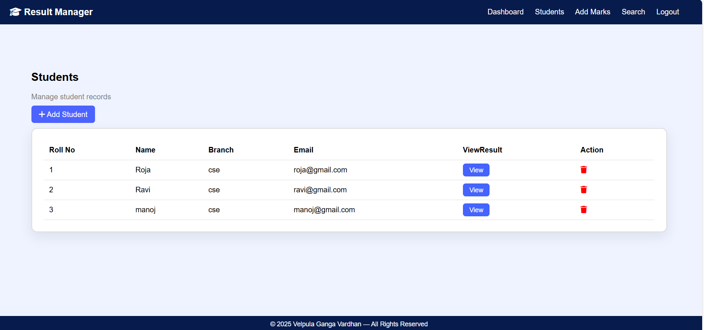
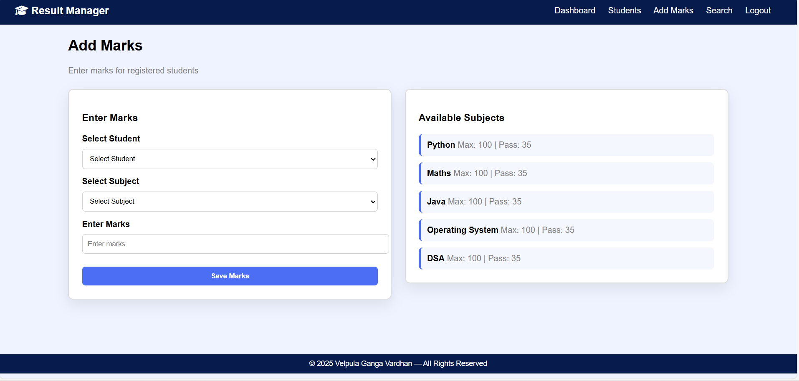
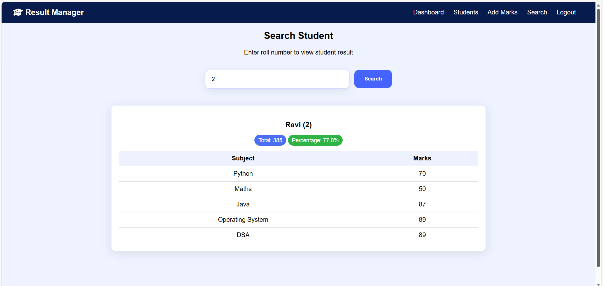

# 🎓 Student Result Management System | Django

A **Professional Web-Based Student Result Management System** designed to simplify student data handling, marks management, and result processing for educational institutions.  
This system ensures **secure authentication, efficient result processing, centralized record management, and instant accessibility**.

---

## 🌍 Live Project
🔗 **Hosted Online:**  
https://student-result-manager-xmbv.onrender.com  

---

## 🏷️ Project Overview


---

## ✨ Key Features

### 👨‍💼 Admin Panel
✔ Secure Admin Login  
✔ Manage Students  
✔ Manage Subjects  
✔ Add / Update / Delete Marks  
✔ Interactive Dashboard Statistics  
✔ Result Search System  

### 👨‍🎓 Student Portal
✔ Register & Login  
✔ View Dashboard  
✔ Check Results  
✔ User-Friendly Interface  

---

## 🛠️ Tech Stack
| Category | Technology |
|--------|-------------|
| Backend | Django |
| Frontend | HTML, CSS |
| Authentication | Django Auth |
| Database | SQLite |
| Server | Render |
| WSGI | Gunicorn |
| Static Files | WhiteNoise |

---

## 📁 Folder Structure
```
student-result-management-system
│── core
│── resultmanager
│── templates
│── static
│── screenshots
│── db.sqlite3
│── manage.py
│── requirements.txt
```

---

# 🖼️ Application Screenshots  

### 🏠 Home Page
A modern home interface introducing the system.


---

### 📝 Register Page
Students can create an account securely.


---

### 🔐 Login Page
Secure authentication for users.


---

### 📊 Dashboard
Shows system statistics like total students, subjects, and marks entries.


---

### 👨‍🎓 Students Page
Displays list of registered students.


---

### 🧮 Add Marks Page
Admin can assign marks to students per subject.


---

### 🔍 Search Result Page
Search and view student academic performance.


---

### 🛡️ Admin Panel
Full Django Admin Backend for complete control.


---

## 🚀 Deployment
The application is hosted live on **Render Cloud Platform**.  
• Built  
• Migrated  
• Static Files Collected  
• Auto Deployment Configured  

---

## 🧪 Testing & Validation
✔ Functional Testing Completed  
✔ UI Testing Completed  
✔ Live Stable  
✔ Responsive UI  

---

## 👨‍💻 Developer
**Velpula Ganga Vardhan**  
📧 Email: gangavardhan2005@gmail.com  
🌐 GitHub: https://github.com/VelpulaGangavardhan  

---

## ⭐ Final Note
This Student Result Management System delivers:
✔ Efficient Record Handling  
✔ Accurate Marks Management  
✔ Instant Result Access  
✔ Professional & Production Ready

If you like this project, please ⭐ the repository!

